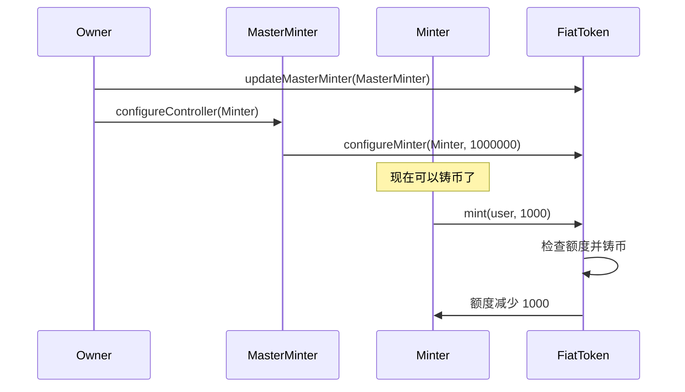
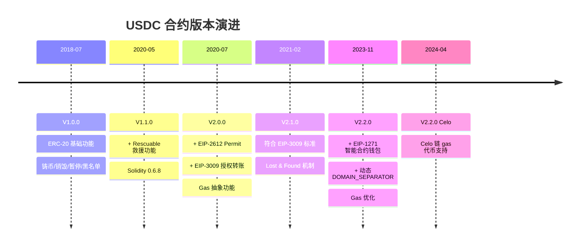
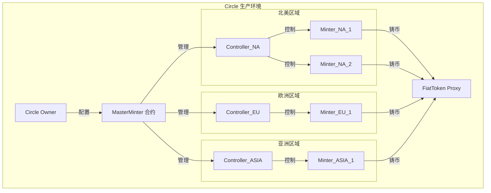

# USDC 稳定币智能合约技术文档

> Circle's Stablecoin Smart Contracts on EVM-compatible blockchains
>
> 📅 最后更新：2024年12月
>
> 🏢 开发方：Circle Internet Group, Inc.

---

## 📑 目录

- [1. 项目概述](#1-项目概述)
- [2. 技术栈](#2-技术栈)
- [3. 核心架构](#3-核心架构)
- [4. 合约结构](#4-合约结构)
- [5. 核心功能详解](#5-核心功能详解)
- [6. 版本演进历史](#6-版本演进历史)
- [7. Gas 抽象功能](#7-gas-抽象功能)
- [8. 铸币管理系统](#8-铸币管理系统)
- [9. 安全机制](#9-安全机制)
- [10. 部署与升级](#10-部署与升级)
- [11. 使用示例](#11-使用示例)
- [12. 常见问题](#12-常见问题)

---

## 1. 项目概述

### 1.1 项目简介

USDC (USD Coin) 是由 Circle 发行的法币支持的稳定币，1 USDC = 1 美元。本项目是 USDC 在 EVM 兼容区块链上的智能合约实现。

**核心特点：**
- ✅ 完全符合 ERC-20 标准
- ✅ 可升级的代理模式架构
- ✅ Gas 抽象功能（免 gas 交易）
- ✅ 多重角色权限管理
- ✅ 紧急暂停和黑名单机制
- ✅ 支持智能合约钱包（EIP-1271）

### 1.2 项目信息

| 项目属性 | 值 |
|---------|---|
| **开源协议** | Apache-2.0 |
| **Solidity 版本** | 0.6.12 |
| **当前版本** | V2.2.0 |
| **GitHub** | [circlefin/stablecoin-evm](https://github.com/circlefin/stablecoin-evm) |
| **审计状态** | ✅ 已审计 |

---

## 2. 技术栈

### 2.1 开发环境

```bash
# 环境要求
Node.js: 20.18.0
Yarn: 1.22.19
Foundry: f625d0f
Solidity: 0.6.12
```

### 2.2 开发框架

- **Hardhat**: 主要测试和开发框架
- **Foundry**: 部署和脚本工具
- **OpenZeppelin**: 基础合约库
- **TypeChain**: 自动生成 TypeScript 类型

### 2.3 开发工具

```bash
# 安装依赖
nvm use
npm i -g yarn@1.22.19
yarn install

# 编译合约
yarn compile

# 运行测试
yarn test

# 静态检查
yarn static-check

# 代码格式化
yarn fmt
```

---

## 3. 核心架构

### 3.1 代理升级模式

USDC 采用 **OpenZeppelin 的代理升级模式**，实现合约功能升级而地址不变。

```
用户/DApp
    ↓
FiatTokenProxy (永久地址，存储数据)
    ↓ delegatecall
FiatTokenV2_2 (实现合约，包含逻辑)
```

**优势：**
- 🔄 合约地址不变，无需更新集成
- 📦 数据持久化在代理合约
- 🚀 可以升级功能和修复漏洞
- 🔐 只有 proxyOwner 可升级

### 3.2 继承关系图

```
IERC20 (接口)
  ↓
AbstractFiatTokenV1
  ↓
FiatTokenV1 ← Ownable, Pausable, Blacklistable
  ↓
FiatTokenV1_1 ← Rescuable
  ↓
FiatTokenV2 ← EIP2612, EIP3009, EIP712Domain
  ↓
FiatTokenV2_1
  ↓
FiatTokenV2_2 (当前版本)
```

### 3.3 角色权限体系

| 角色 | 权限 | 管理者 |
|------|------|--------|
| **Owner** | 管理其他所有角色 | 部署者/转移后的地址 |
| **ProxyOwner** | 升级合约实现 | 独立地址（最高权限） |
| **MasterMinter** | 管理铸币者和额度 | Owner 指定 |
| **Minter** | 铸造和销毁代币 | MasterMinter 配置 |
| **Pauser** | 暂停/恢复合约 | Owner 指定 |
| **Blacklister** | 管理黑名单 | Owner 指定 |
| **Rescuer** | 救援误转代币 | Owner 指定 |

---

## 4. 合约结构

### 4.1 目录结构

```
contracts/
├── v1/                      # V1 版本合约 (2018)
│   ├── Ownable.sol         # 所有权管理
│   ├── Pausable.sol        # 暂停机制
│   ├── Blacklistable.sol   # 黑名单管理
│   ├── AbstractFiatTokenV1.sol
│   ├── FiatTokenV1.sol     # V1 核心实现
│   └── FiatTokenProxy.sol  # 代理合约
│
├── v1.1/                    # V1.1 版本 (2020-05)
│   ├── Rescuable.sol       # 代币救援
│   └── FiatTokenV1_1.sol
│
├── v2/                      # V2 版本 (2020-07)
│   ├── EIP712Domain.sol    # EIP-712 域分隔符
│   ├── EIP2612.sol         # Permit 功能
│   ├── EIP3009.sol         # 授权转账
│   ├── AbstractFiatTokenV2.sol
│   ├── FiatTokenV2.sol     # V2 核心
│   ├── FiatTokenV2_1.sol   # V2.1 (2021-02)
│   ├── FiatTokenV2_2.sol   # V2.2 (2023-11)
│   ├── celo/               # Celo 链专用
│   │   ├── FiatTokenCeloV2_2.sol
│   │   └── FiatTokenFeeAdapterV1.sol
│   └── upgrader/           # 升级器合约
│       ├── V2Upgrader.sol
│       ├── V2_1Upgrader.sol
│       └── V2_2Upgrader.sol
│
├── minting/                 # 铸币管理
│   ├── Controller.sol      # 控制器基类
│   ├── MintController.sol  # 铸币控制器
│   └── MasterMinter.sol    # 主铸币管理器
│
├── upgradeability/          # 升级机制
│   ├── Proxy.sol
│   ├── UpgradeabilityProxy.sol
│   └── AdminUpgradeabilityProxy.sol
│
├── util/                    # 工具库
│   ├── ECRecover.sol       # ECDSA 签名恢复
│   ├── EIP712.sol          # EIP-712 工具
│   ├── MessageHashUtils.sol # 消息哈希
│   └── SignatureChecker.sol # 签名验证
│
└── interface/               # 接口定义
    ├── IERC1271.sol        # 智能合约钱包接口
    └── celo/               # Celo 接口
```

### 4.2 核心合约列表

| 合约 | 功能 | 类型 |
|------|------|------|
| **FiatTokenV2_2** | 当前版本实现合约 | 逻辑合约 |
| **FiatTokenProxy** | 代理合约 | 数据存储 |
| **MasterMinter** | 铸币管理器 | 独立合约 |

---

## 5. 核心功能详解

### 5.1 ERC-20 标准功能

#### 基础接口

```solidity
// 查询总供应量
function totalSupply() external view returns (uint256);

// 查询余额
function balanceOf(address account) external view returns (uint256);

// 转账
function transfer(address to, uint256 value) external returns (bool);

// 查询授权额度
function allowance(address owner, address spender) external view returns (uint256);

// 授权
function approve(address spender, uint256 value) external returns (bool);

// 授权转账
function transferFrom(address from, address to, uint256 value) external returns (bool);
```

#### 安全授权（V2 新增）

```solidity
// 增加授权（避免多重提取攻击）
function increaseAllowance(address spender, uint256 increment) external returns (bool);

// 减少授权
function decreaseAllowance(address spender, uint256 decrement) external returns (bool);
```

### 5.2 铸币和销毁

```solidity
// 铸币（只有铸币者可调用）
function mint(address to, uint256 amount) external returns (bool);

// 销毁（铸币者销毁自己的代币）
function burn(uint256 amount) external;

// 配置铸币者（只有 masterMinter 可调用）
function configureMinter(address minter, uint256 minterAllowedAmount)
    external returns (bool);

// 移除铸币者
function removeMinter(address minter) external returns (bool);

// 查询铸币额度
function minterAllowance(address minter) external view returns (uint256);

// 检查是否是铸币者
function isMinter(address account) external view returns (bool);
```

**铸币流程：**



### 5.3 暂停机制

```solidity
// 暂停合约（只有 pauser 可调用）
function pause() external;

// 恢复合约
function unpause() external;

// 查询暂停状态
function paused() external view returns (bool);

// 更新 pauser 地址（只有 owner 可调用）
function updatePauser(address newPauser) external;
```

**暂停时的限制：**
- ❌ 无法转账（transfer, transferFrom）
- ❌ 无法授权（approve）
- ❌ 无法铸币（mint）
- ❌ 无法销毁（burn）
- ✅ 可以查询余额和授权
- ✅ 可以恢复合约（unpause）

### 5.4 黑名单机制

```solidity
// 加入黑名单（只有 blacklister 可调用）
function blacklist(address account) external;

// 移出黑名单
function unBlacklist(address account) external;

// 查询是否在黑名单
function isBlacklisted(address account) external view returns (bool);

// 更新 blacklister 地址（只有 owner 可调用）
function updateBlacklister(address newBlacklister) external;
```

**黑名单地址的限制：**
- ❌ 无法转账（发送和接收）
- ❌ 无法铸币到黑名单地址
- ❌ 无法授权给黑名单地址（V2.2 移除此限制）
- ⚠️ 代币被永久冻结在黑名单地址

### 5.5 代币救援（V1.1+）

```solidity
// 救援误转入的 ERC20 代币（只有 rescuer 可调用）
function rescueERC20(
    IERC20 tokenContract,
    address to,
    uint256 amount
) external;

// 更新 rescuer 地址（只有 owner 可调用）
function updateRescuer(address newRescuer) external;
```

**使用场景：**
- 用户误将其他 ERC20 代币转入 USDC 合约
- 用户误将 USDC 转入 USDC 合约自身

---

## 6. 版本演进历史

### 6.1 版本时间线



### 6.2 V1.0.0 (2018-07-24)

**核心功能：**
- ✅ ERC-20 完整实现
- ✅ 铸币和销毁机制
- ✅ 暂停功能
- ✅ 黑名单管理
- ✅ 多角色权限控制
- ✅ 代理升级模式

**技术栈：**
- Solidity 0.4.24
- OpenZeppelin Contracts

### 6.3 V1.1.0 (2020-05-27)

**新增功能：**
- ➕ Rescuable 代币救援功能
- ⬆️ Solidity 升级到 0.6.8
- 🔧 移除 FiatTokenProxy 的 ifAdmin 修饰符

### 6.4 V2.0.0 (2020-07-30) 🌟

**革命性升级：Gas 抽象**

**新增功能：**
1. **EIP-2612 Permit**
   - permit() 免 gas 授权

2. **EIP-3009 授权转账**
   - transferWithAuthorization()
   - approveWithAuthorization()
   - increaseAllowanceWithAuthorization()
   - decreaseAllowanceWithAuthorization()

3. **安全增强**
   - increaseAllowance()
   - decreaseAllowance()

4. **技术升级**
   - ⬆️ Solidity 0.6.12
   - ➕ EIP-712 结构化签名

### 6.5 V2.1.0 (2021-02-17)

**功能调整：**
- ♻️ 符合 EIP-3009 标准
  - ➕ receiveWithAuthorization()（防抢跑版本）
  - ➖ 移除 approveWithAuthorization()
  - ➖ 移除 increaseAllowanceWithAuthorization()
  - ➖ 移除 decreaseAllowanceWithAuthorization()

- 🔒 Lost & Found 机制
  - 将锁定的 USDC 转移到专用地址
  - 将该地址加入黑名单防止再次误转

### 6.6 V2.2.0 (2023-11-09) 🚀

**重大升级：**

1. **智能合约钱包支持（EIP-1271）**
   - ✅ permit() 支持智能合约钱包签名
   - ✅ 所有授权函数支持 EIP-1271
   - ✅ 兼容 Gnosis Safe、Argent 等

2. **动态 DOMAIN_SEPARATOR**
   - 🔄 从缓存改为动态计算
   - 🌐 支持硬分叉后的链 ID 变化
   - 🔐 增强跨链安全性

3. **Gas 优化**
   - ⚡ 合并余额和黑名单状态存储
   - 💾 节省一个 SLOAD 操作
   - 📉 降低 gas 消耗

4. **黑名单优化**
   - ➖ 移除 approve() 的黑名单检查
   - ➖ 移除 increaseAllowance() 的黑名单检查
   - ➖ 移除 decreaseAllowance() 的黑名单检查
   - ➖ 移除 permit() 的黑名单检查

5. **时间戳灵活性**
   - ✅ permit() 支持 uint256.max 表示永不过期

**存储优化对比：**

```solidity
// V2.1 及之前：分离存储
mapping(address => uint256) internal balances;  // 余额
mapping(address => bool) internal blacklisted;  // 黑名单

// V2.2：合并存储
mapping(address => uint256) internal balanceAndBlacklistStates;
// 第 1 位：黑名单状态 (0=正常, 1=黑名单)
// 后 255 位：余额
```

### 6.7 V2.2.0 Celo 变体 (2024-04-08)

**Celo 链专用功能：**
- ➕ FiatTokenCeloV2_2（实现 ICeloGasToken）
- ➕ FiatTokenFeeAdapterV1（Gas 费适配器）
- ✅ 支持 USDC 作为 Celo 链的 gas 代币
- ✅ debitGasFees() 和 creditGasFees()

---

## 7. Gas 抽象功能

### 7.1 EIP-2612: Permit（免 Gas 授权）

#### 功能说明

允许用户通过链下签名完成授权，第三方可代为提交签名到链上。

#### 接口定义

```solidity
function permit(
    address owner,      // 代币所有者
    address spender,    // 被授权者
    uint256 value,      // 授权数量
    uint256 deadline,   // 过期时间（Unix时间戳 或 uint256.max）
    uint8 v,           // 签名 v
    bytes32 r,         // 签名 r
    bytes32 s          // 签名 s
) external;

function nonces(address owner) external view returns (uint256);

bytes32 public constant PERMIT_TYPEHASH = keccak256(
    "Permit(address owner,address spender,uint256 value,uint256 nonce,uint256 deadline)"
);
```

#### 使用示例

**传统方式（V1）：**
```javascript
// 步骤 1: 用户授权（消耗 gas）
await usdcContract.approve(dexAddress, amount, { from: user });

// 步骤 2: DEX 执行交易（消耗 gas）
await dexContract.swap(amount, { from: user });

// 总计：2 笔交易，用户支付 2 次 gas
```

**Permit 方式（V2）：**
```javascript
// 步骤 1: 用户链下签名（免费）
const deadline = Math.floor(Date.now() / 1000) + 3600; // 1小时后过期
const nonce = await usdcContract.nonces(userAddress);

const domain = {
    name: 'USD Coin',
    version: '2',
    chainId: 1,
    verifyingContract: usdcAddress
};

const types = {
    Permit: [
        { name: 'owner', type: 'address' },
        { name: 'spender', type: 'address' },
        { name: 'value', type: 'uint256' },
        { name: 'nonce', type: 'uint256' },
        { name: 'deadline', type: 'uint256' }
    ]
};

const value = {
    owner: userAddress,
    spender: dexAddress,
    value: amount,
    nonce: nonce,
    deadline: deadline
};

const signature = await user._signTypedData(domain, types, value);
const { v, r, s } = ethers.utils.splitSignature(signature);

// 步骤 2: DEX 在一笔交易中完成 permit + swap（DEX 支付 gas）
await dexContract.swapWithPermit(
    amount,
    deadline,
    v, r, s,
    { from: dexRelayer }
);

// 总计：1 笔交易，用户不支付 gas
```

#### 适用场景

| 场景 | 描述 | 优势 |
|------|------|------|
| **DEX 交易** | 用户签名授权，DEX 代付 gas | 一笔交易完成 |
| **DApp 补贴** | 应用为新用户支付 gas | 降低准入门槛 |
| **批量操作** | 收集多个签名，批量执行 | 提高效率 |
| **跨链桥** | 简化跨链操作流程 | 改善用户体验 |

### 7.2 EIP-3009: 授权转账

#### 功能说明

允许用户签署转账授权，任何人可提交该授权完成转账。

#### transferWithAuthorization（通用版）

```solidity
function transferWithAuthorization(
    address from,           // 付款方
    address to,            // 收款方
    uint256 value,         // 转账金额
    uint256 validAfter,    // 生效时间
    uint256 validBefore,   // 过期时间
    bytes32 nonce,         // 随机 nonce
    uint8 v, bytes32 r, bytes32 s  // 签名
) external;
```

**使用示例：**

```javascript
// 场景：Alice 授权转账 100 USDC 给 Bob，任何人可提交

// 1. Alice 链下签名
const nonce = ethers.utils.randomBytes(32); // 随机 nonce
const validAfter = 0; // 立即生效
const validBefore = Math.floor(Date.now() / 1000) + 86400; // 24小时后过期

const domain = {
    name: 'USD Coin',
    version: '2',
    chainId: 1,
    verifyingContract: usdcAddress
};

const types = {
    TransferWithAuthorization: [
        { name: 'from', type: 'address' },
        { name: 'to', type: 'address' },
        { name: 'value', type: 'uint256' },
        { name: 'validAfter', type: 'uint256' },
        { name: 'validBefore', type: 'uint256' },
        { name: 'nonce', type: 'bytes32' }
    ]
};

const value = {
    from: aliceAddress,
    to: bobAddress,
    value: ethers.utils.parseUnits('100', 6),
    validAfter: validAfter,
    validBefore: validBefore,
    nonce: nonce
};

const signature = await alice._signTypedData(domain, types, value);
const { v, r, s } = ethers.utils.splitSignature(signature);

// 2. 任何人（如 Bob 或中继者）提交授权
await usdcContract.transferWithAuthorization(
    aliceAddress,
    bobAddress,
    ethers.utils.parseUnits('100', 6),
    validAfter,
    validBefore,
    nonce,
    v, r, s,
    { from: relayerAddress } // 中继者支付 gas
);
```

#### receiveWithAuthorization（防抢跑版）

```solidity
function receiveWithAuthorization(
    address from,
    address to,
    uint256 value,
    uint256 validAfter,
    uint256 validBefore,
    bytes32 nonce,
    uint8 v, bytes32 r, bytes32 s
) external;
```

**特点：**
- ✅ 只有收款方（to）可以提交
- 🔒 防止第三方抢跑（front-running）
- 🎯 适合 P2P 转账场景

**对比：**

| 特性 | transferWithAuthorization | receiveWithAuthorization |
|------|---------------------------|--------------------------|
| 提交者 | 任何人 | 只有收款方 |
| 安全性 | 一般（可能被抢跑） | 高（防抢跑） |
| 灵活性 | 高 | 低 |
| 场景 | 批量支付、中继网络 | P2P 转账、工资发放 |

#### cancelAuthorization（取消授权）

```solidity
function cancelAuthorization(
    address authorizer,
    bytes32 nonce,
    uint8 v, bytes32 r, bytes32 s
) external;
```

**使用场景：**
- 🔐 发现授权泄露，立即取消
- 🔄 改变主意，不想执行转账
- ⏰ 授权即将过期，主动取消

### 7.3 Nonce 机制对比

| 特性 | EIP-2612 Permit | EIP-3009 授权转账 |
|------|----------------|------------------|
| Nonce 类型 | 顺序递增的 uint256 | 随机的 bytes32 |
| 生成方式 | 自动递增 | 手动生成随机值 |
| 并行性 | 必须按顺序使用 | 可并行签署多笔 |
| 查询方式 | nonces(address) | authorizationState(address, bytes32) |
| 适用场景 | 单笔授权 | 批量/并行授权 |

---

## 8. 铸币管理系统

### 8.1 架构模式

USDC 使用 **Owner-Controller-Worker** 三层模型管理铸币权限。

```
Owner (最高权限)
  ↓ 管理
MasterMinter (主铸币管理器)
  ↓ 配置
Controller (控制器，可多个)
  ↓ 管理
Minter (铸币者/工作者)
  ↓ 执行
FiatToken (代币合约)
```

### 8.2 MasterMinter 合约

#### 功能

```solidity
contract MasterMinter is MintController {
    // 继承自 Controller 的功能
    function configureController(address controller, address minter) external onlyOwner;
    function removeController(address controller) external onlyOwner;

    // 继承自 MintController 的功能
    function configureMinter(uint256 minterAllowedAmount) external onlyController;
    function incrementMinterAllowance(uint256 increment) external onlyController;
    function decrementMinterAllowance(uint256 decrement) external onlyController;
    function removeMinter() external onlyController;
}
```

#### 使用流程

```javascript
// 1. 部署 MasterMinter
const masterMinter = await MasterMinter.deploy(fiatTokenAddress);

// 2. 设置 FiatToken 的 masterMinter
await fiatToken.updateMasterMinter(masterMinter.address, { from: owner });

// 3. 配置控制器和铸币者
await masterMinter.configureController(
    controllerAddress,  // 控制器地址
    minterAddress,      // 铸币者地址
    { from: owner }
);

// 4. 控制器为铸币者配置额度
await masterMinter.configureMinter(
    ethers.utils.parseUnits('1000000', 6),  // 100万 USDC 额度
    { from: controllerAddress }
);

// 5. 铸币者开始铸币
await fiatToken.mint(
    userAddress,
    ethers.utils.parseUnits('100', 6),
    { from: minterAddress }
);
```

### 8.3 实际部署示例



### 8.4 铸币额度管理

```javascript
// 查询铸币者额度
const allowance = await fiatToken.minterAllowance(minterAddress);
console.log(`剩余额度: ${ethers.utils.formatUnits(allowance, 6)} USDC`);

// 增加额度（由控制器执行）
await masterMinter.incrementMinterAllowance(
    ethers.utils.parseUnits('500000', 6),  // 增加 50万
    { from: controllerAddress }
);

// 减少额度
await masterMinter.decrementMinterAllowance(
    ethers.utils.parseUnits('100000', 6),  // 减少 10万
    { from: controllerAddress }
);

// 移除铸币者（额度归零）
await masterMinter.removeMinter({ from: controllerAddress });
```

---

## 9. 安全机制

### 9.1 权限控制矩阵

| 操作 | Owner | ProxyOwner | MasterMinter | Minter | Pauser | Blacklister | Rescuer | User |
|------|-------|------------|--------------|--------|--------|-------------|---------|------|
| 升级合约 | ❌ | ✅ | ❌ | ❌ | ❌ | ❌ | ❌ | ❌ |
| 转移所有权 | ✅ | ❌ | ❌ | ❌ | ❌ | ❌ | ❌ | ❌ |
| 更新 MasterMinter | ✅ | ❌ | ❌ | ❌ | ❌ | ❌ | ❌ | ❌ |
| 更新 Pauser | ✅ | ❌ | ❌ | ❌ | ❌ | ❌ | ❌ | ❌ |
| 更新 Blacklister | ✅ | ❌ | ❌ | ❌ | ❌ | ❌ | ❌ | ❌ |
| 更新 Rescuer | ✅ | ❌ | ❌ | ❌ | ❌ | ❌ | ❌ | ❌ |
| 配置铸币者 | ❌ | ❌ | ✅ | ❌ | ❌ | ❌ | ❌ | ❌ |
| 铸币 | ❌ | ❌ | ❌ | ✅ | ❌ | ❌ | ❌ | ❌ |
| 销毁 | ❌ | ❌ | ❌ | ✅ | ❌ | ❌ | ❌ | ❌ |
| 暂停/恢复 | ❌ | ❌ | ❌ | ❌ | ✅ | ❌ | ❌ | ❌ |
| 黑名单管理 | ❌ | ❌ | ❌ | ❌ | ❌ | ✅ | ❌ | ❌ |
| 救援代币 | ❌ | ❌ | ❌ | ❌ | ❌ | ❌ | ✅ | ❌ |
| 转账 | ❌ | ❌ | ❌ | ❌ | ❌ | ❌ | ❌ | ✅ |
| 授权 | ❌ | ❌ | ❌ | ❌ | ❌ | ❌ | ❌ | ✅ |

### 9.2 安全特性

#### 9.2.1 防重放攻击

**Domain Separator（域分隔符）**

```solidity
// V2.2 动态计算
function _domainSeparator() internal view returns (bytes32) {
    return keccak256(
        abi.encode(
            keccak256("EIP712Domain(string name,string version,uint256 chainId,address verifyingContract)"),
            keccak256(bytes(name)),
            keccak256(bytes("2")),
            block.chainid,  // 动态获取链 ID
            address(this)
        )
    );
}
```

**防护机制：**
- 🔐 防止跨合约重放：绑定合约地址
- 🔐 防止跨链重放：绑定链 ID
- 🔐 防止多次使用：Nonce 机制

#### 9.2.2 时间窗口控制

```solidity
// EIP-2612: deadline（截止时间）
require(
    deadline == type(uint256).max || deadline >= now,
    "FiatTokenV2: permit is expired"
);

// EIP-3009: validAfter 和 validBefore（时间窗口）
require(now > validAfter, "FiatTokenV2: authorization is not yet valid");
require(now < validBefore, "FiatTokenV2: authorization is expired");
```

#### 9.2.3 存储槽冲突防护

使用 OpenZeppelin 的非结构化存储模式：

```solidity
// AdminUpgradeabilityProxy
bytes32 internal constant ADMIN_SLOT =
    keccak256("org.zeppelinos.proxy.admin");

bytes32 internal constant IMPLEMENTATION_SLOT =
    keccak256("org.zeppelinos.proxy.implementation");
```

#### 9.2.4 SafeMath 保护

```solidity
using SafeMath for uint256;

// 防止整数溢出
totalSupply_ = totalSupply_.add(_amount);
_setBalance(_to, _balanceOf(_to).add(_amount));

// 防止整数下溢
totalSupply_ = totalSupply_.sub(_amount);
_setBalance(msg.sender, balance.sub(_amount));
```

### 9.3 应急响应机制

#### 场景 1: 发现严重漏洞

```javascript
// 1. 立即暂停合约（由 Pauser 执行）
await fiatToken.pause({ from: pauserAddress });

// 2. 评估影响范围

// 3. 部署修复后的新实现合约
const newImplementation = await FiatTokenV2_3.deploy();

// 4. 升级合约（由 ProxyOwner 执行）
await proxy.upgradeTo(newImplementation.address, { from: proxyOwnerAddress });

// 5. 恢复合约
await fiatToken.unpause({ from: pauserAddress });
```

#### 场景 2: 发现恶意地址

```javascript
// 将恶意地址加入黑名单
await fiatToken.blacklist(maliciousAddress, { from: blacklisterAddress });

// 该地址的代币被永久冻结
// 无法转入或转出
```

#### 场景 3: 用户误转代币

```javascript
// 查看合约中锁定的代币
const balance = await otherToken.balanceOf(usdcAddress);

// 救援代币（由 Rescuer 执行）
await fiatToken.rescueERC20(
    otherTokenAddress,
    userAddress,
    balance,
    { from: rescuerAddress }
);
```

---

## 10. 部署与升级

### 10.1 初始部署流程

```javascript
// 1. 部署实现合约
const FiatTokenV2_2 = await ethers.getContractFactory("FiatTokenV2_2");
const implementation = await FiatTokenV2_2.deploy();
await implementation.deployed();

// 2. 部署代理合约
const FiatTokenProxy = await ethers.getContractFactory("FiatTokenProxy");
const proxy = await FiatTokenProxy.deploy(implementation.address);
await proxy.deployed();

// 3. 通过代理初始化
const fiatToken = FiatTokenV2_2.attach(proxy.address);

await fiatToken.initialize(
    "USD Coin",              // tokenName
    "USDC",                  // tokenSymbol
    "USD",                   // tokenCurrency
    6,                       // tokenDecimals
    masterMinterAddress,     // newMasterMinter
    pauserAddress,           // newPauser
    blacklisterAddress,      // newBlacklister
    ownerAddress             // newOwner
);

// 4. V2 初始化
await fiatToken.initializeV2("USD Coin");

// 5. V2.1 初始化（如果需要）
await fiatToken.initializeV2_1(lostAndFoundAddress);

// 6. V2.2 初始化（如果需要）
await fiatToken.initializeV2_2(accountsToBlacklist, newSymbol);
```

### 10.2 合约升级流程

#### 使用 Upgrader 合约升级

```javascript
// 1. 部署新实现合约
const FiatTokenV2_3 = await ethers.getContractFactory("FiatTokenV2_3");
const newImplementation = await FiatTokenV2_3.deploy();

// 2. 部署 Upgrader Helper
const V2_3UpgraderHelper = await ethers.getContractFactory("V2_3UpgraderHelper");
const helper = await V2_3UpgraderHelper.deploy();

// 3. 配置 Helper
await helper.setNewImplementation(newImplementation.address);
await helper.setNewProxyAdmin(newProxyAdminAddress);

// 4. 部署 Upgrader
const V2_3Upgrader = await ethers.getContractFactory("V2_3Upgrader");
const upgrader = await V2_3Upgrader.deploy(
    proxy.address,
    newImplementation.address,
    await proxy.admin(),
    helper.address
);

// 5. 转移代理管理权给 Upgrader
await proxy.changeAdmin(upgrader.address, { from: currentAdmin });

// 6. 执行升级
await upgrader.upgrade();

// 7. 验证升级
const currentImpl = await proxy.implementation();
assert(currentImpl === newImplementation.address);
```

### 10.3 多链部署

USDC 已部署到多条链：

| 链名称 | 合约地址 | 区块浏览器 |
|--------|----------|-----------|
| Ethereum | 0xA0b86991c6218b36c1d19D4a2e9Eb0cE3606eB48 | [Etherscan](https://etherscan.io/token/0xA0b86991c6218b36c1d19D4a2e9Eb0cE3606eB48) |
| Polygon | 0x2791Bca1f2de4661ED88A30C99A7a9449Aa84174 | [Polygonscan](https://polygonscan.com/token/0x2791Bca1f2de4661ED88A30C99A7a9449Aa84174) |
| Arbitrum | 0xaf88d065e77c8cC2239327C5EDb3A432268e5831 | [Arbiscan](https://arbiscan.io/token/0xaf88d065e77c8cC2239327C5EDb3A432268e5831) |
| Optimism | 0x0b2C639c533813f4Aa9D7837CAf62653d097Ff85 | [Optimistic Etherscan](https://optimistic.etherscan.io/token/0x0b2c639c533813f4aa9d7837caf62653d097ff85) |
| Avalanche | 0xB97EF9Ef8734C71904D8002F8b6Bc66Dd9c48a6E | [Snowtrace](https://snowtrace.io/token/0xB97EF9Ef8734C71904D8002F8b6Bc66Dd9c48a6E) |

---

## 11. 使用示例

### 11.1 基础转账

```javascript
const ethers = require('ethers');

// 连接到网络
const provider = new ethers.providers.JsonRpcProvider(RPC_URL);
const wallet = new ethers.Wallet(PRIVATE_KEY, provider);

// 连接合约
const usdcAddress = '0xA0b86991c6218b36c1d19D4a2e9Eb0cE3606eB48';
const usdcAbi = [...]; // USDC ABI
const usdc = new ethers.Contract(usdcAddress, usdcAbi, wallet);

// 转账 100 USDC
const amount = ethers.utils.parseUnits('100', 6); // USDC 是 6 位小数
const tx = await usdc.transfer(recipientAddress, amount);
await tx.wait();

console.log(`转账成功: ${tx.hash}`);
```

### 11.2 使用 Permit 授权

```javascript
// 构造 Permit 签名
async function signPermit(owner, spender, value, deadline) {
    const nonce = await usdc.nonces(owner.address);

    const domain = {
        name: 'USD Coin',
        version: '2',
        chainId: await owner.getChainId(),
        verifyingContract: usdc.address
    };

    const types = {
        Permit: [
            { name: 'owner', type: 'address' },
            { name: 'spender', type: 'address' },
            { name: 'value', type: 'uint256' },
            { name: 'nonce', type: 'uint256' },
            { name: 'deadline', type: 'uint256' }
        ]
    };

    const message = {
        owner: owner.address,
        spender: spender,
        value: value,
        nonce: nonce,
        deadline: deadline
    };

    const signature = await owner._signTypedData(domain, types, message);
    return ethers.utils.splitSignature(signature);
}

// 使用 Permit
const deadline = Math.floor(Date.now() / 1000) + 3600; // 1小时后过期
const amount = ethers.utils.parseUnits('100', 6);

const { v, r, s } = await signPermit(wallet, spenderAddress, amount, deadline);

// 提交 Permit
const tx = await usdc.permit(
    wallet.address,
    spenderAddress,
    amount,
    deadline,
    v, r, s
);
await tx.wait();

console.log('Permit 授权成功');
```

### 11.3 使用授权转账

```javascript
// 签署授权转账
async function signTransferAuthorization(from, to, value, validAfter, validBefore) {
    const nonce = ethers.utils.randomBytes(32);

    const domain = {
        name: 'USD Coin',
        version: '2',
        chainId: await from.getChainId(),
        verifyingContract: usdc.address
    };

    const types = {
        TransferWithAuthorization: [
            { name: 'from', type: 'address' },
            { name: 'to', type: 'address' },
            { name: 'value', type: 'uint256' },
            { name: 'validAfter', type: 'uint256' },
            { name: 'validBefore', type: 'uint256' },
            { name: 'nonce', type: 'bytes32' }
        ]
    };

    const message = {
        from: from.address,
        to: to,
        value: value,
        validAfter: validAfter,
        validBefore: validBefore,
        nonce: nonce
    };

    const signature = await from._signTypedData(domain, types, message);
    const { v, r, s } = ethers.utils.splitSignature(signature);

    return { nonce, v, r, s };
}

// 执行授权转账
const validAfter = 0; // 立即生效
const validBefore = Math.floor(Date.now() / 1000) + 86400; // 24小时后过期
const amount = ethers.utils.parseUnits('100', 6);

const { nonce, v, r, s } = await signTransferAuthorization(
    wallet,
    recipientAddress,
    amount,
    validAfter,
    validBefore
);

// 任何人都可以提交（此处由中继者提交）
const tx = await usdc.connect(relayer).transferWithAuthorization(
    wallet.address,
    recipientAddress,
    amount,
    validAfter,
    validBefore,
    nonce,
    v, r, s
);
await tx.wait();

console.log('授权转账成功');
```

### 11.4 智能合约钱包使用 Permit

```javascript
// Gnosis Safe 使用 Permit 的示例
const GnosisSafe = await ethers.getContractFactory("GnosisSafe");
const safe = GnosisSafe.attach(safeAddress);

// 1. 构造 Permit 消息
const permitMessage = {
    owner: safe.address,  // Gnosis Safe 地址
    spender: dexAddress,
    value: amount,
    nonce: await usdc.nonces(safe.address),
    deadline: deadline
};

// 2. Safe 的所有者签名
const signature = await safeOwner.signMessage(
    ethers.utils.arrayify(permitMessageHash)
);

// 3. 通过 Safe 调用 Permit
const safeTransaction = await safe.execTransaction(
    usdc.address,
    0,
    usdc.interface.encodeFunctionData('permit', [
        safe.address,
        dexAddress,
        amount,
        deadline,
        signature
    ]),
    0, // CALL
    0, 0, 0,
    ethers.constants.AddressZero,
    ethers.constants.AddressZero,
    safeSignature
);

await safeTransaction.wait();
console.log('Safe Permit 授权成功');
```

---

## 12. 常见问题

### Q1: USDC 和 USDT 有什么区别？

| 特性 | USDC | USDT |
|------|------|------|
| 发行方 | Circle + Coinbase | Tether |
| 储备透明度 | 高（定期审计） | 中 |
| Gas 抽象 | ✅ 支持（EIP-2612/3009） | ❌ 不支持 |
| 智能合约钱包 | ✅ 支持（EIP-1271） | ❌ 不支持 |
| 小数位 | 6 | 6 |
| 可升级 | ✅ | ✅ |

### Q2: 为什么 USDC 使用 6 位小数而不是 18 位？

- 💵 **对标美元**：1.000000 USDC = $1.00，更直观
- ⛽ **节省 Gas**：更小的数字存储
- 💰 **精度足够**：最小单位 0.000001 USDC（百万分之一美元）

### Q3: 代理模式升级后，用户需要做什么？

**答：什么都不需要！**

- ✅ 代理地址不变
- ✅ 余额自动保留
- ✅ 授权自动保留
- ✅ 所有 DApp 集成无需更改

### Q4: 黑名单地址的代币会发生什么？

- 🔒 **永久冻结**：代币无法转出
- ❌ **无法接收**：无法转入新的代币
- ⚠️ **不可恢复**：即使移出黑名单，已冻结的代币仍在该地址

### Q5: Permit 和传统 approve 有什么区别？

| 特性 | approve | permit |
|------|---------|--------|
| 签名位置 | 链上 | 链下 |
| Gas 费用 | 用户支付 | 可由第三方支付 |
| 交易数量 | 2笔（approve + transferFrom） | 1笔 |
| 用户体验 | 繁琐 | 流畅 |
| 过期时间 | 无 | 可设置 |

### Q6: 如何检测某个地址是否在黑名单？

```javascript
const isBlacklisted = await usdc.isBlacklisted(address);
console.log(`地址 ${address} ${isBlacklisted ? '在' : '不在'}黑名单中`);
```

### Q7: 合约暂停后还能做什么操作？

**可以执行的操作：**
- ✅ 查询余额（balanceOf）
- ✅ 查询授权（allowance）
- ✅ 查询总供应量（totalSupply）
- ✅ 恢复合约（unpause，仅 pauser）

**不能执行的操作：**
- ❌ 转账（transfer, transferFrom）
- ❌ 授权（approve, permit）
- ❌ 铸币（mint）
- ❌ 销毁（burn）

### Q8: V2.2 的存储优化节省了多少 Gas？

**对比（以太坊主网）：**

| 操作 | V2.1 Gas | V2.2 Gas | 节省 |
|------|----------|----------|------|
| transfer (to 首次) | ~52,000 | ~45,000 | ~13% |
| transfer (to 已有余额) | ~37,000 | ~32,000 | ~13% |
| mint | ~51,000 | ~44,000 | ~13% |

**原理：**
- V2.1：2 个 SLOAD（余额 + 黑名单）
- V2.2：1 个 SLOAD（合并存储）
- 每个 SLOAD ≈ 2,100 gas

### Q9: 如何验证合约是否已升级？

```javascript
// 1. 查询当前实现地址
const currentImpl = await proxy.implementation();
console.log('当前实现:', currentImpl);

// 2. 对比预期地址
if (currentImpl === newImplementationAddress) {
    console.log('✅ 升级成功');
} else {
    console.log('❌ 升级失败或未升级');
}

// 3. 调用新功能测试
try {
    // 尝试调用新版本特有的功能
    await usdc.newFunction();
    console.log('✅ 新功能可用');
} catch (error) {
    console.log('❌ 新功能不可用');
}
```

### Q10: 如何为 DApp 集成 USDC 的 Gas 抽象功能？

```javascript
// DApp 合约示例
contract MyDApp {
    IERC20 public usdc;

    // 使用 permit 的一键交易
    function swapWithPermit(
        uint256 amount,
        uint256 deadline,
        uint8 v, bytes32 r, bytes32 s
    ) external {
        // 1. 执行 permit（用户已签名）
        usdc.permit(
            msg.sender,
            address(this),
            amount,
            deadline,
            v, r, s
        );

        // 2. 立即执行转账（同一笔交易）
        usdc.transferFrom(msg.sender, address(this), amount);

        // 3. 执行业务逻辑
        _executeSwap(amount);
    }
}
```

---

## 📚 参考资源

### 官方文档

- [GitHub 仓库](https://github.com/circlefin/stablecoin-evm)
- [Circle 官网](https://www.circle.com/en/usdc)
- [USDC 白皮书](https://www.circle.com/hubfs/PDFs/USDC_Whitepaper.pdf)

### EIP 标准

- [EIP-20: ERC-20 Token Standard](https://eips.ethereum.org/EIPS/eip-20)
- [EIP-712: Typed structured data hashing and signing](https://eips.ethereum.org/EIPS/eip-712)
- [EIP-2612: Permit Extension for ERC-20](https://eips.ethereum.org/EIPS/eip-2612)
- [EIP-3009: Transfer With Authorization](https://eips.ethereum.org/EIPS/eip-3009)
- [EIP-1271: Standard Signature Validation for Contracts](https://eips.ethereum.org/EIPS/eip-1271)

### 技术文档

- [OpenZeppelin Contracts](https://docs.openzeppelin.com/contracts/)
- [Hardhat Documentation](https://hardhat.org/getting-started/)
- [Foundry Book](https://book.getfoundry.sh/)

### 安全审计

- [Centre Consortium Audit Reports](https://www.centre.io/usdc-transparency)

---

## 📝 更新日志

- **2024-12-16**: 创建初始版本
- 基于 USDC V2.2.0 合约代码编写
- 包含所有核心功能和使用示例

---

## 📧 联系方式

- **Circle 官方支持**: https://www.circle.com/en/support
- **开发者社区**: https://github.com/circlefin/stablecoin-evm/discussions

---

## ⚖️ 免责声明

本文档仅供技术参考，不构成投资建议。使用 USDC 智能合约需遵守相关法律法规。Circle 保留随时修改合约和文档的权利。

---

**© 2024 Circle Internet Group, Inc. All rights reserved.**

