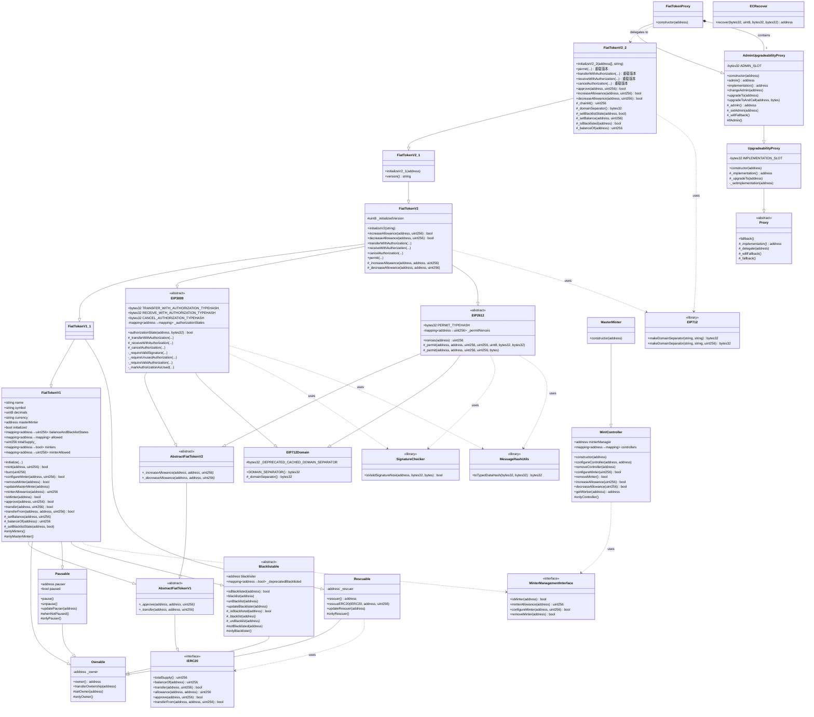

# USDC 稳定币智能合约架构类图

## Mermaid UML 类图



## 架构说明

### 🏗️ 架构分层

#### 1. 核心代币合约层（Token Core）

- **FiatTokenV1** (2018年): 最初版本
  - ✅ ERC20 标准实现
  - ✅ 铸币/销毁机制
  - ✅ 暂停功能
  - ✅ 黑名单功能
  - ✅ 多角色权限管理

- **FiatTokenV1_1** (2020年): 救援版本
  - ➕ Rescuable 功能（救援误转入的代币）
  - ⬆️ Solidity 0.6.8 升级

- **FiatTokenV2** (2020年): EIP 标准版本
  - ➕ EIP-2612: permit 免 gas 授权
  - ➕ EIP-3009: transferWithAuthorization 免 gas 转账
  - ➕ increaseAllowance / decreaseAllowance

- **FiatTokenV2_1** (2021年): 锁定资金处理
  - 🔧 处理合约自身地址锁定的资金
  - 🔒 将合约地址加入黑名单

- **FiatTokenV2_2** (2023年): 存储优化版本
  - ⚡ 合并余额和黑名单状态（节省 gas）
  - 🔐 支持 EIP-1271 智能合约钱包签名
  - 🆕 动态链 ID 支持（防止硬分叉后的重放攻击）
  - 🔄 新的签名重载版本

#### 2. 权限管理模块

| 合约 | 角色 | 功能 |
|-----|------|------|
| **Ownable** | owner | 最高权限，管理其他角色 |
| **Pausable** | pauser | 紧急暂停合约 |
| **Blacklistable** | blacklister | 管理黑名单（合规） |
| **Rescuable** | rescuer | 救援误转代币 |

#### 3. EIP 标准实现

- **EIP712Domain**: 域分隔符，用于结构化数据签名
- **EIP2612**: permit 功能，免 gas 授权
- **EIP3009**: 免 gas 转账授权

#### 4. 代理升级系统

```
Proxy (基础)
  └─ UpgradeabilityProxy (可升级)
      └─ AdminUpgradeabilityProxy (带管理员)
          └─ FiatTokenProxy (USDC 专用)
```

**核心机制**:

- 使用 `delegatecall` 转发调用
- 状态存储在代理合约
- 实现合约可升级
- Admin 控制升级权限

#### 5. 铸币管理系统

**三层架构**:

```
Owner (最高权限)
  └─ MasterMinter (主铸币管理器)
      └─ MintController (控制器)
          └─ Minters (铸币者)
```

### 📊 关键设计模式

#### 1. 代理模式（Proxy Pattern）

- **目的**: 实现合约可升级性，保持地址不变
- **实现**: 使用 `delegatecall` 委托调用
- **优势**: 状态持久化、逻辑可升级

#### 2. 多重继承（Multiple Inheritance）

```
FiatTokenV2_2
  ├─ FiatTokenV2_1
  │   ├─ FiatTokenV2
  │   │   ├─ FiatTokenV1_1
  │   │   │   ├─ FiatTokenV1 (Ownable, Pausable, Blacklistable)
  │   │   │   └─ Rescuable
  │   │   ├─ EIP3009
  │   │   └─ EIP2612
```

#### 3. 角色权限模型（RBAC）

- **Owner**: 最高权限
- **Pauser**: 暂停/恢复
- **Blacklister**: 黑名单管理
- **MasterMinter**: 铸币管理
- **Rescuer**: 资产救援
- **Minters**: 执行铸币

#### 4. 初始化模式（Initializer Pattern）

- 使用 `initialize()` 替代 `constructor()`
- 适配代理模式
- 防止重复初始化

### 🔐 版本演进时间线

```
2018年 ───► V1          基础 ERC20 + 铸币 + 暂停 + 黑名单
                │
2020年5月 ─► V1.1        + 救援功能 (Rescuable)
                │
2020年8月 ─► V2          + EIP-2612 + EIP-3009
                │
2021年2月 ─► V2.1        + 锁定资金处理
                │
2023年6月 ─► V2.2        + 存储优化 + EIP-1271 + 动态链ID
```

### 💡 核心特性

#### V1 核心功能

- ✅ 完整的 ERC20 实现
- ✅ 多铸币者管理（MasterMinter 模式）
- ✅ 暂停机制（紧急停止）
- ✅ 黑名单机制（合规要求）
- ✅ 初始化保护

#### V2 新增功能

- 🆕 **permit()**: 免 gas 授权
  - 用户链下签名，第三方提交
  - 只需一笔交易完成授权+操作

- 🆕 **transferWithAuthorization()**: 免 gas 转账
  - 发送方签名，任何人可提交
  - 灵活的时间窗口控制

- 🆕 **receiveWithAuthorization()**: 防抢跑转账
  - 只有收款方能提交
  - 防止第三方截取

#### V2.2 优化

- ⚡ **存储优化**: 合并余额和黑名单状态
  - 节省一个存储槽（约 20,000 gas）
  - 使用位运算操作

- 🔐 **EIP-1271 支持**: 智能合约钱包签名
  - 兼容 Gnosis Safe 等多签钱包
  - 统一的签名验证接口

### 🛠️ 工具库

| 库名 | 功能 | 用途 |
|-----|------|------|
| **EIP712** | 创建域分隔符 | 结构化数据签名 |
| **ECRecover** | ECDSA 签名恢复 | 验证 EOA 签名 |
| **SignatureChecker** | 统一签名验证 | 支持 EOA + EIP-1271 |
| **MessageHashUtils** | 消息哈希 | EIP-712 哈希计算 |

### 📝 存储布局兼容性

**关键原则**:

1. ❌ 不能删除已有状态变量
2. ❌ 不能改变已有变量的顺序
3. ❌ 不能改变已有变量的类型
4. ✅ 只能在末尾添加新变量

**V2.2 存储优化示例**:

```solidity
// V1: 分离存储
mapping(address => uint256) balanceAndBlacklistStates;  // 仅存余额
mapping(address => bool) _deprecatedBlacklisted;        // 存黑名单

// V2.2: 合并存储
// balanceAndBlacklistStates[addr] = [黑名单标志位 (1 bit) | 余额 (255 bits)]
// 最高位 = 1: 黑名单
// 低 255 位: 余额
```

### 🎯 实际应用

**部署架构**:

```
FiatTokenProxy (用户交互地址)
    ↓ delegatecall
FiatTokenV2_2 (逻辑实现)
    ↓ calls
MasterMinter (铸币管理)
    ↓ manages
Minters (实际铸币者)
```

**升级流程**:

1. 部署新实现合约（如 FiatTokenV3）
2. Proxy admin 调用 `upgradeTo(newImplementation)`
3. 可选：调用 `upgradeToAndCall()` 执行初始化
4. 所有后续调用自动使用新逻辑

### 📚 相关资源

- **合约地址** (主网):
  - Proxy: `0xA0b86991c6218b36c1d19D4a2e9Eb0cE3606eB48`
  - 当前实现: FiatTokenV2_2

- **相关标准**:
  - [EIP-20: ERC20 Token Standard](https://eips.ethereum.org/EIPS/eip-20)
  - [EIP-712: Typed structured data hashing and signing](https://eips.ethereum.org/EIPS/eip-712)
  - [EIP-2612: permit – 712-signed approvals](https://eips.ethereum.org/EIPS/eip-2612)
  - [EIP-3009: Transfer With Authorization](https://eips.ethereum.org/EIPS/eip-3009)
  - [EIP-1271: Standard Signature Validation Method for Contracts](https://eips.ethereum.org/EIPS/eip-1271)

---

**生成时间**: 2025年12月17日
**合约版本**: FiatTokenV2_2
**文档版本**: 1.0
